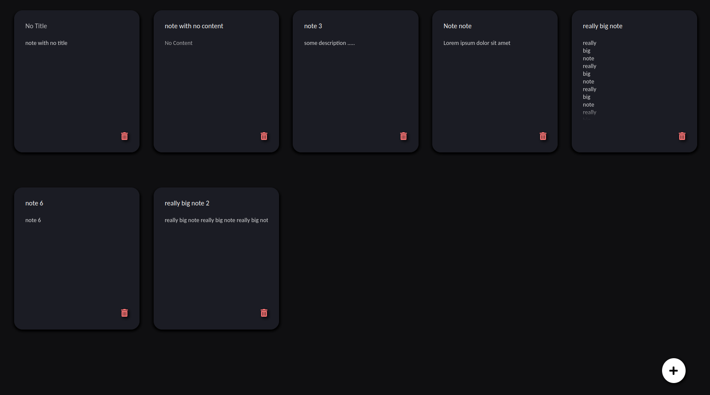

# Notes app



A simple web application for writing notes written with React, Express.js and MySQL.

The backend part can be found [here](https://github.com/gabrielmaia2/NotesBackend).

## Running

Download both frontend and backend code:

```bash
git clone https://github.com/gammag4/NotesApp
git clone https://github.com/gammag4/NotesBackend
```

Configure MySQL:

```bash
sudo apt install mysql-server
sudo mysql -e "CREATE USER 'username'@'localhost' IDENTIFIED WITH caching_sha2_password BY 'password';"
sudo mysql -e "CREATE DATABASE notes_db;"
sudo mysql -e "GRANT ALL PRIVILEGES ON notes_db.* TO 'username'@'localhost';"
sudo mysql -e "FLUSH PRIVILEGES;"
mysql -u gabriel -p notes_db < notes-backend/create_database.sql
```

Create `.env` file in notes-backend with this structure:

```bash
DB_HOST=localhost
DB_USER=your_user
DB_PASS=your_password
DB_NAME=notes_db
```

Run both front and backend and access the app through `http://localhost:3000/`:

```bash
cd notes-backend && yarn start
```

```bash
cd notes-app && yarn start
```
